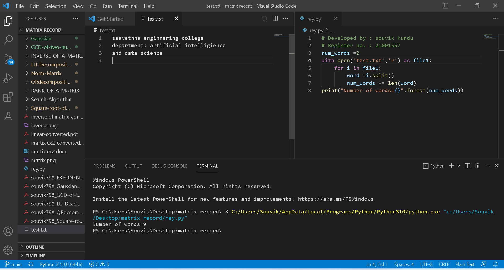

# Word-count
## AIM:
To write a python program for getting the word count from a text.
## EQUIPEMENT'S REQUIRED: 
PC
Anaconda - Python 3.7
## ALGORITHM: 
### Step 1:

Get the string from user

### Step 2: 

 count will check repeated words in given string

### Step 3: 

use split() to split the string

### Step 4: 

now check every word in string

### Step 5: 

print the count

### Step 6:

End the program

## PROGRAM:
~~~
# Developed by : souvik kundu
# Register no. : 21001557
num_words =0
with open('test.txt','r') as file1:
    for i in file1:
        word =i.split()
        num_words += len(word)
print("Number of words={}".format(num_words))

~~~

### OUTPUT:

## RESULT:
Thus the program is written to find the word count from a text.
